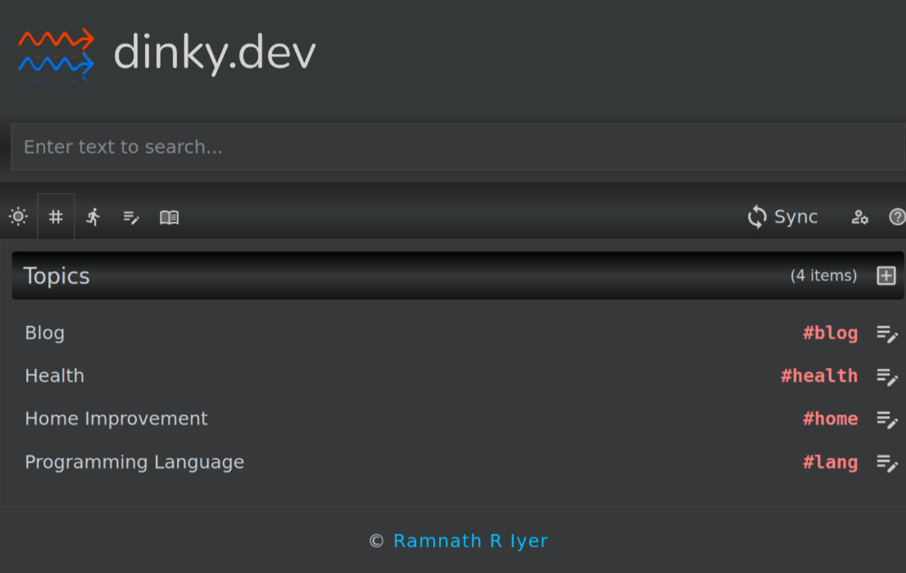

+++
title = "dinky.dev"
date = 2026-03-17T00:00:00-07:00
[taxonomies]
authors = ["Ramnath R Iyer"]
tags = ["tasks", "notes", "books"]
[extra]
allow_comments = true
+++

[dinky.dev](https://dinky.dev) is a web application designed to act as a combination of task list,
notes app, library manager and project tool (albeit a very simple one). **dinky** is built on top of
the [React](https://react.dev/) framework and is an entirely client-side application: all user data
is stored in a single JSON file stashed away in the browser's LocalStorage. To enable
synchronization of data across user devices, it allows users to bring their own Amazon S3 bucket to
upload data into.

Its [user guide](https://dinky.dev/help) does a fairly thorough job of explaining what you can do
with it, and how to set it up. Today, however, I wanted to walk through its [source
code](https://github.com/rri/dinky) in some detail and highlight interesting parts of its design and
architecture.

The main entry point of the application is at
[index.tsx](https://github.com/rri/dinky/blob/main/src/index.tsx). As you can see here, the source
is entirely in TypeScript and JSX (hence the *tsx* extension). Subsequent code is split into three
areas within respective folders: [views](https://github.com/rri/dinky/tree/main/src/views),
[pages](https://github.com/rri/dinky/tree/main/src/pages) and
[models](https://github.com/rri/dinky/tree/main/src/models). **Views** constitute standalone modules
that may be rendered wherever needed. The
[App](https://github.com/rri/dinky/blob/main/src/views/App.tsx) view is the first one to be rendered
by the *index.tsx* entry point, and it declares additional views to be
rendered as part of that process. For example, the
[SearchBox](https://github.com/rri/dinky/blob/main/src/views/SearchBox.tsx) view is rendered by the
*App* view; this is why the homepage shows a search bar close to the top. **Pages** are technically
nothing more than views rendered in the central content area. Which 'page' to render is determined
by the router in
[PageContent](https://github.com/rri/dinky/blob/77ce571e5d5f9fb07b795ba3224eb480f4f7b7eb/src/views/PageContent.tsx#L96).
**Models** constitute the core data structures and algorithms of the application. For the most part,
data structures are implemented as interfaces, instantiated as needed by the application. For
instance, [AppState](https://github.com/rri/dinky/blob/main/src/models/AppState.tsx) is a core data
structure that is hydrated in *App.tsx*
[when data is imported from a file](https://github.com/rri/dinky/blob/77ce571e5d5f9fb07b795ba3224eb480f4f7b7eb/src/views/App.tsx#L266),
[when data is synced from the cloud](https://github.com/rri/dinky/blob/77ce571e5d5f9fb07b795ba3224eb480f4f7b7eb/src/views/App.tsx#L294)
and
[when the web application is loaded](https://github.com/rri/dinky/blob/77ce571e5d5f9fb07b795ba3224eb480f4f7b7eb/src/views/App.tsx#L296).
Furthermore, many data structures are declared as types that happen to be various combinations of
interfaces. For instance, the
[Task](https://github.com/rri/dinky/blob/77ce571e5d5f9fb07b795ba3224eb480f4f7b7eb/src/models/Task.tsx#L4-L5)
type is a union of *DataObj*, *Creatable*, *Deletable*, *Updatable*, *Syncable*,
*Schedulable*, and *Completable*. This method works very well as long as each of these interfaces
declares distinct and non-overlapping defining attributes.

As a general rule, the application renders current state; actions taken by the user update the
current state and refresh the application, which in turn renders the (updated) current state.
Exceptions to this rule are updates to Amazon
S3 ([pushData](https://github.com/rri/dinky/blob/77ce571e5d5f9fb07b795ba3224eb480f4f7b7eb/src/models/Cloud.tsx#L54),
[pushEvents](https://github.com/rri/dinky/blob/77ce571e5d5f9fb07b795ba3224eb480f4f7b7eb/src/models/Cloud.tsx#L181))
and updates to the JSON file in local storage
([saveToDisk](https://github.com/rri/dinky/blob/77ce571e5d5f9fb07b795ba3224eb480f4f7b7eb/src/models/Store.tsx#L356)).

Staying *offline-first* has been a key design principle for the application. This principle means
that all updates are local, and any synchronization to the cloud is optional and on-demand. Certain
quality-of-life features have been added along the way. For instance, initially, no synchronization
to the cloud occurred unless the user explicitly requested it (synchronization meant that the entire
JSON file was downloaded, merged, and re-uploaded); while this worked fine for *pulling* data from
the cloud, it didn't work as well for *pushing* data to the cloud, especially when the user forgot
to sync on some device and needed the updates elsewhere. This was soon fixed with the *auto-push*
option that made a best-effort attempt to push individual items the cloud upon each save.

The use of [conflict-free replicated data
types](https://en.wikipedia.org/wiki/Conflict-free_replicated_data_type) (CRDTs) makes it
particularly straightforward to deal with data syncrhonization. Each data object is timestamped, and
the algorithm for merging data objects into the store is, for the most part, "keep the last updated
version". This heuristic works well because the data objects are fairly granular (such as a single
task). An interesting side-effect of this approach is that it is important to tombstone and retain
deleted items for several days until all devices have had time to synchronize, otherwise you may end
up reviving deleted items as if they were new.

An easy-to-use text interface has been another key design motivation. A *text interface* in this
context means that I can simply type what I want into a single field. For instance, typing
*Evaluate Like A Grandmaster | Eugene Perelshteyn; Nate Solon* followed by *Enter* leads to an entry
like the one below. In a similar vein, pasting multi-line text into the task entry box results in
*multiple* tasks being created. Entering a task automatically prompts for the next one (and so on).

Of course, there is a lot of scope for improvement. With 1000+ items, loading the library can be a
tad sluggish the first time. Switching from LocalStorage to IndexedDB might be a step forward. The
application could also benefit from creative theming --- I opted for function over form.
